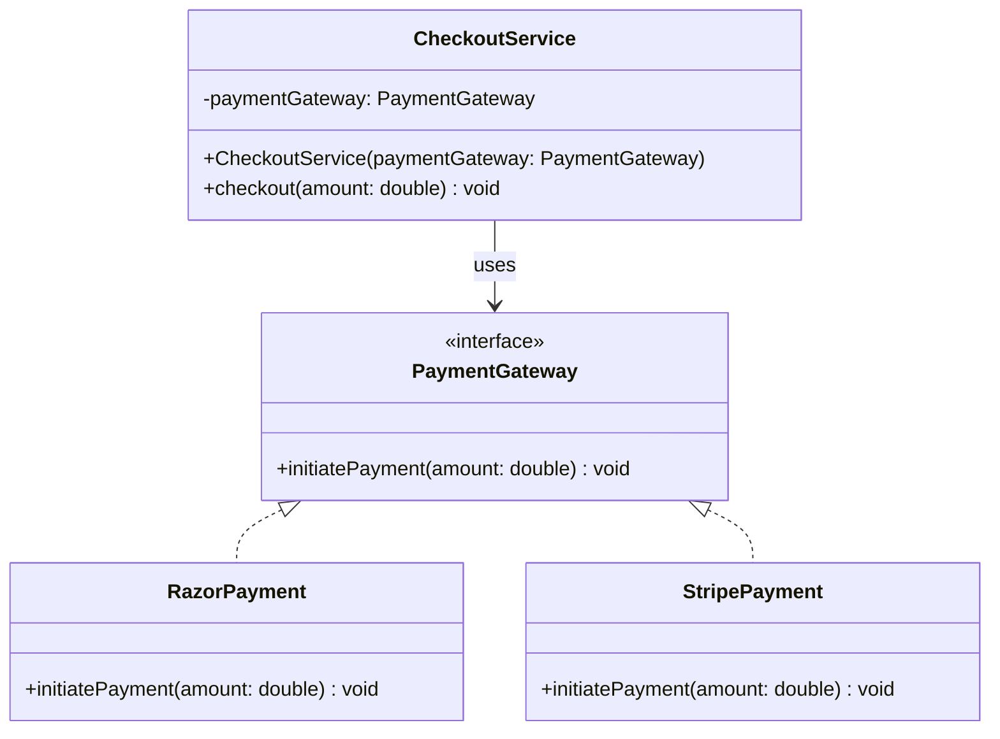

# Payment Process System

This project demonstrates the **Strategy Pattern** using interfaces in Java. It provides a flexible payment processing system that supports multiple payment gateways.

## Overview

The Payment Process System allows different payment methods to be used interchangeably through a common interface. This design enables easy addition of new payment providers without modifying existing code.

## Architecture

### Components

- **PaymentGateway** (Interface): Defines the contract for all payment gateway implementations
- **CheckoutService** (Client): Coordinates the payment process using dependency injection
- **RazorPayment** (Concrete Strategy): Implementation for Razorpay gateway
- **StripePayment** (Concrete Strategy): Implementation for Stripe gateway

## UML Diagram



## Design Pattern: Strategy Pattern

The Strategy Pattern defines a family of algorithms, encapsulates each one, and makes them interchangeable.

### Benefits:
- **Open/Closed Principle**: Open for extension (adding new payment gateways), closed for modification
- **Loose Coupling**: CheckoutService depends on abstraction, not concrete implementations
- **Easy Testing**: Mock payment gateways can be easily injected for testing
- **Runtime Flexibility**: Can switch payment methods at runtime

## Usage Example

```java
// Using Razorpay
PaymentGateway gateway = new RazorPayment();
CheckoutService checkout = new CheckoutService(gateway);
checkout.checkout(100.0);  // Output: Processing RazorPayment of 100.0

// Switching to Stripe
gateway = new StripePayment();
checkout = new CheckoutService(gateway);
checkout.checkout(200.0);  // Output: Processing StripePayment of 200.0
```

## Adding a New Payment Gateway

To add a new payment method (e.g., PayPal):

1. Create a new class implementing `PaymentGateway`
2. Implement the `initiatePayment` method
3. Use it with `CheckoutService`

```java
public class PayPalPayment implements PaymentGateway {
    public void initiatePayment(double amount) {
        System.out.println("Processing PayPal payment of " + amount);
    }
}
```

## Files

- `PaymentGateway.java` - Interface defining payment contract
- `CheckoutService.java` - Client class that uses payment gateways
- `RazorPayment.java` - Razorpay implementation
- `StripePayment.java` - Stripe implementation
